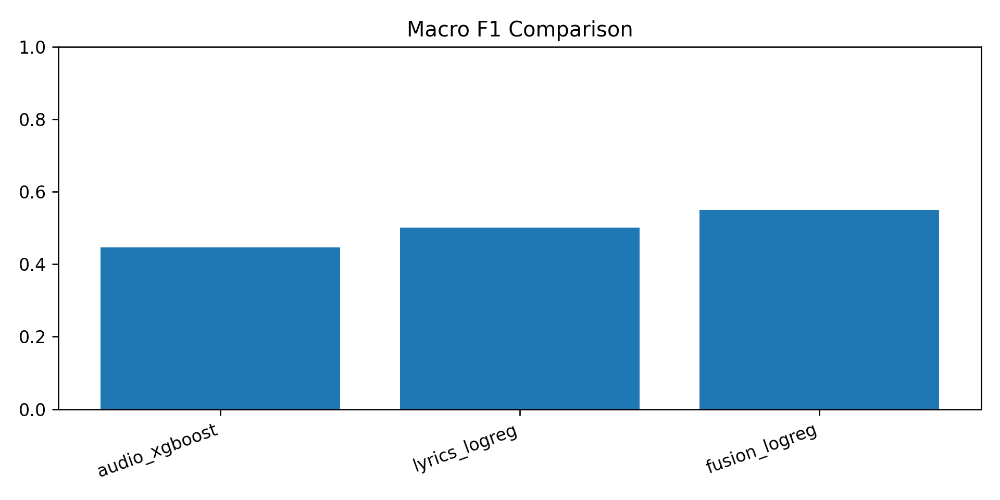
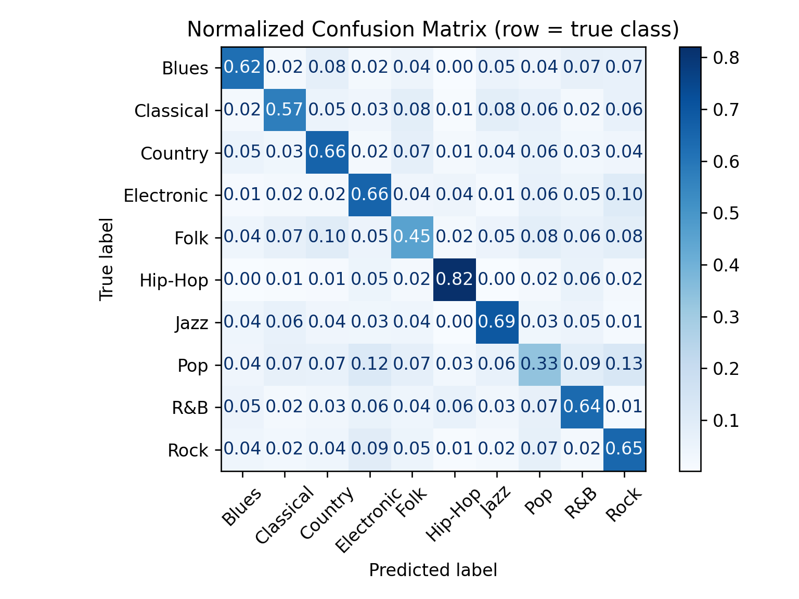
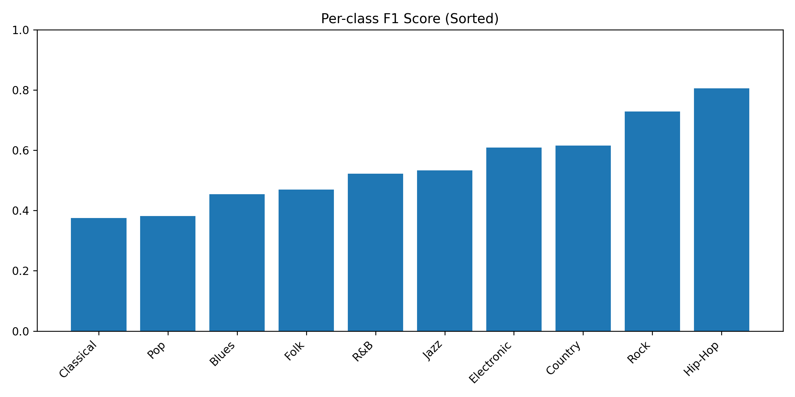

# Spotify Genre Classifier (Audio + Lyrics)

An end-to-end machine learning project that predicts a song’s primary genre using:

- Spotify audio features (danceability, energy, tempo, etc.)
- Lyrics (TF-IDF)
- A combined fusion model that uses both

The goal of this repo is to show a clean, reproducible workflow: dataset setup → training → evaluation figures → CLI predictions.

---

## Dataset

This project uses the Kaggle dataset:

https://www.kaggle.com/datasets/serkantysz/550k-spotify-songs-audio-lyrics-and-genres/data?select=songs.csv

Download and place these files here:

- `data/raw/songs.csv`
- `data/raw/artists.csv`

Raw data and trained models are not tracked in git.

---

## Project Structure

```
    spotify-genre-classifier/
      data/
        raw/                (songs.csv, artists.csv - not tracked)
        processed/          (optional generated files)
      models/               (trained .joblib artifacts - not tracked)
      notebooks/
        01_eda_overview.ipynb
      reports/
        figures/
          final/            (final evaluation figures)
      src/
        config.py
        data_load.py
        preprocess.py
        train_audio.py
        train_lyrics.py
        train_fusion.py
        evaluate.py
        predict.py
      tests/
        (basic smoke tests)
```

---

## Quickstart

### 1) Setup

Create and activate a virtual environment, then install dependencies.

Windows:

- `python -m venv .venv`
- `.venv\\Scripts\\activate`
- `pip install -r requirements.txt`

Mac/Linux:

- `python -m venv .venv`
- `source .venv/bin/activate`
- `pip install -r requirements.txt`

### 2) Train models

- `python -m src.train_audio`
- `python -m src.train_lyrics`
- `python -m src.train_fusion`

Trained artifacts are saved to `models/` (ignored by git).

### 3) Generate evaluation figures

Run per-model evaluation:

- `python -m src.evaluate --model audio_logreg`
- `python -m src.evaluate --model audio_xgboost`
- `python -m src.evaluate --model lyrics_logreg`
- `python -m src.evaluate --model fusion_logreg`

Run cross-model comparisons:

- `python -m src.evaluate --compare`

Figures are saved to: `reports/figures/final/`

### 4) Run predictions (CLI)

- `python -m src.predict --help`
- `python -m src.predict --model fusion_logreg --text "take a bunch of empty words and make them mean something"`

---

## Results

### Overall performance

| model                           |  accuracy |  macro f1 | weighted f1 |
| ------------------------------- | --------: | --------: | ----------: |
| audio (logreg)                  |     0.426 |     0.297 |       0.415 |
| audio (xgboost)                 |     0.576 |     0.446 |       0.552 |
| lyrics (tf-idf + logreg)        |     0.535 |     0.501 |       0.545 |
| fusion (audio + lyrics, logreg) | **0.602** | **0.549** |   **0.608** |

The fusion model performs best overall. Lyrics provide strong genre cues from vocabulary and themes, while audio features add complementary signal from tempo and energy patterns.

---

## Figures

Macro F1 comparison:


Per-class F1 heatmap:


Fusion model confusion matrix (normalized):


Fusion model per-class F1:


---

## Per-genre patterns (F1)

Across models, rock and hip-hop are consistently the easiest genres to classify.

- Hip-hop performs best with lyrics and fusion (0.791 with lyrics → 0.805 with fusion). This is likely because TF-IDF captures genre-specific slang that is common in hip-hop lyrics.
- Rock is strong across audio and fusion (0.753 with audio XGBoost, 0.728 with fusion). Rock is also one of the most common classes, but the high F1 suggests the models are not just guessing rock blindly.

Pop is consistently one of the hardest genres:

- 0.294 (audio XGBoost), 0.371 (lyrics), 0.382 (fusion)

A likely reason is that pop is a broad label with overlap into electronic, R&B, and rock. Both the audio profile and lyrical content can look less distinctive than more rigid genres.

---

## Class imbalance and underrepresented genres

Lower-resource genres tend to lag, especially in audio-only models. Examples:

- Blues: 0.219 (audio XGBoost) → 0.426 (lyrics) → 0.454 (fusion)
- Classical: 0.293 (audio XGBoost) → 0.318 (lyrics) → 0.375 (fusion)

This is a common multi-class issue: when some classes have fewer examples (or are internally diverse), models have a harder time learning stable decision boundaries. The gains from lyrics and fusion suggest text provides stronger anchors for these genres than audio features alone.

---

## Why macro F1 matters

The dataset is imbalanced (some genres appear much more often than others). Accuracy and weighted F1 can look good even if smaller genres perform poorly. Macro F1 treats each genre equally, so it’s the most informative single number for balanced performance across all genres.

---

## Notes

- Audio models train on Spotify numeric audio features with standard preprocessing (imputation + scaling).
- Lyrics use TF-IDF + logistic regression as a strong, interpretable baseline for text classification.
- Fusion combines audio and lyrics features in a single scikit-learn pipeline.
- Final figures and comparisons live in `reports/figures/final/`.
